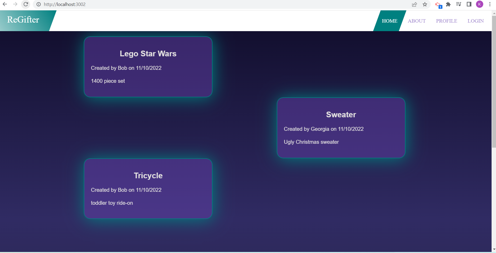
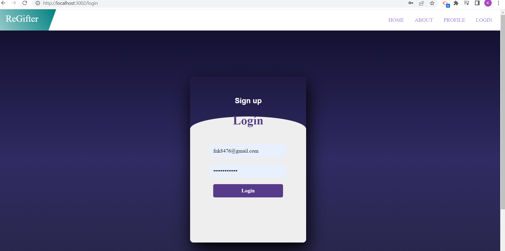
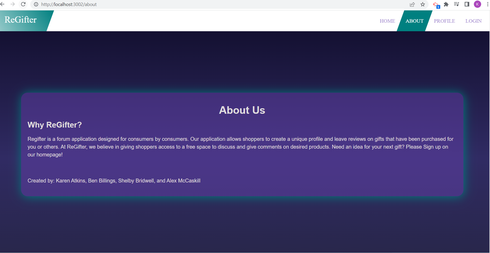
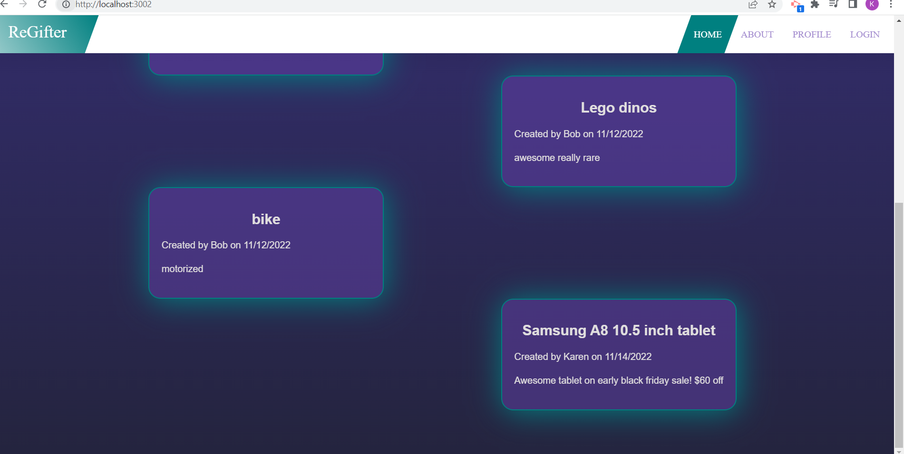
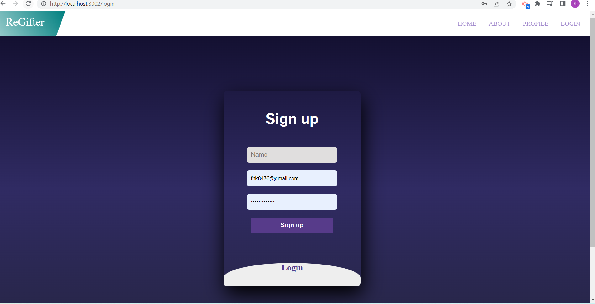
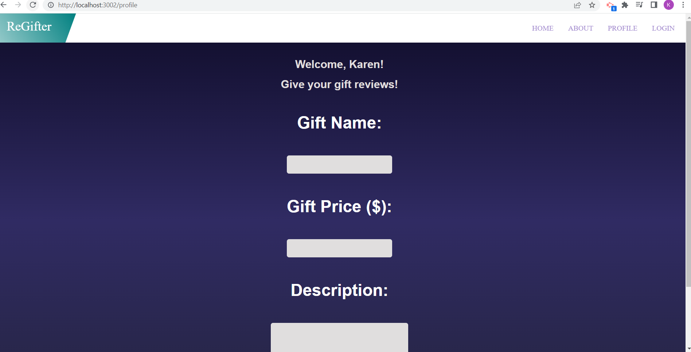

# ReGifter 
"The Yelp of gift reviews"

## User Story 
As a shopper, I want access to a free space to discuss and give comments on desired products, so that I can make informed purchases and also review gifts I have purchased.

## Description 
A place to share personal reviews of gifts given or received. A consumer driven product review application. This is a forum type application where the average consumer can login to  give their honest reviews for gifted items in the hopes of informing other consumers of the positives and negatives of the products purchased intended as gifts. 

## Technolgies && Languages 
HTML, CSS, Javascript, Bootstrap, AOS, Express, Node.js, MySQL, Sequelize, Handlebars.js

### Screenshots 

### Github Repo 
https://github.com/KarenAdkins84/TheShop

### Portfolio Links
Karen - https://github.com/KarenAdkins84/MyPortfolio

Ben - https://benbillings.github.io/Personal-Portfolio/index.html

Shelby - https://shelbybridwell.github.io/Professional_Portforlio/

Alex - https://github.com/Mccaskillk/Alex-s-Web-Portfolio

### Deployed Application 
https://infinite-caverns-09243.herokuapp.com/
